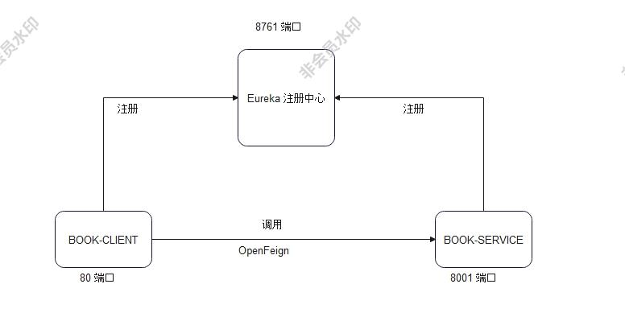

## 分布式计算

### w1

将基于 TCP 协议的 Client-Server 通信程序示例的服务器端程序改造成线程池版。

### w2

利用 RPC 技术实现一个基于 C/S（客户端+服务器端）架构的书籍信息管理系统，具体要求：

客户端实现用户交互，服务器端实现书籍信息存储和管理。客户端与服务器端利用 RPC 机制进行协作。中间件任选。

服务器端至少暴露如下RPC接口：

bool add(Book b)   添加一个书籍对象。

Book queryByID(int bookID) 查询指定ID号的书籍对象。

BookList queryByName(String name) 按书名查询符合条件的书籍对象列表，支持模糊查询。

bool delete(int bookID) 删除指定ID号的书籍对象。

实现架构图：

### w3

利用基于消息队列中间件的通信技术实现一个分布式随机信号分析系统，具体要求：

1. 随机信号产生器节点每隔100毫秒左右就产生一个正态分布的随机数字，并作为一个消息发布。

2. 随机信号统计分析节点对信号进行如下分析：

   （1）计算过去N个随机信号的均值和方差（N为常量，可设置）；

   （2）计算所有历史数据中的最大值和最小值；

   （3）定时地将分析结果打包成一个新消息并通过MOM发布出去。

3. 实时数据显示节点实现如下功能：

   （1）实时绘制过去一段时间内随机信号的折线图；

   （2）实时显示随机信号统计分析结果。

4. 消息中间件任选。

实现架构图：

