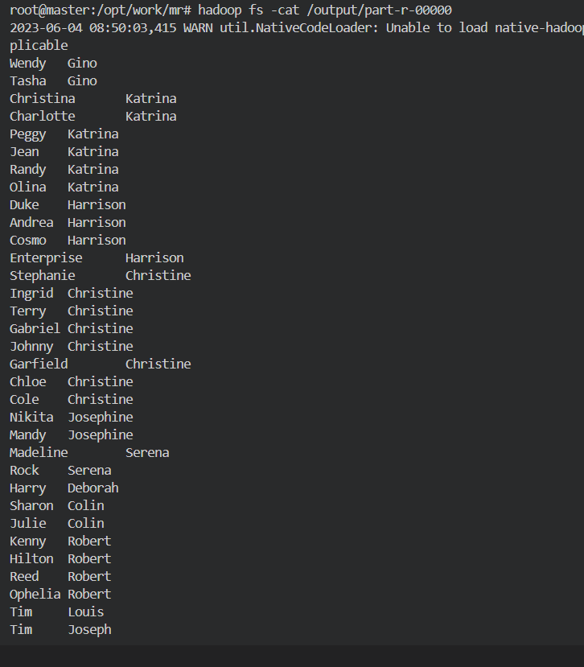

# 分布式计算课程实验报告

- 姓名：江志航
- 学号：20009100359

## 实验目的

学习基于 MapReduce 框架的分布式计算程序设计方法。

## 实验要求

### 题目 1 

输入文件为学生成绩信息，包含了必修课与选修课成绩，格式如下：

```
班级 1, 姓名 1, 科目 1, 必修, 成绩 1 <br> （注：<br> 为换行符）
班级 2, 姓名 2, 科目 1, 必修, 成绩 2 <br>
班级 1, 姓名 1, 科目 2, 选修，成绩 3 <br>
………., ………, ………, ……… <br>
```

编写两个 Hadoop 平台上的 MapReduce 程序，分别实现如下功能：

1. 计算每个学生必修课的平均成绩。
2. 按科目统计每个班的平均成绩。

### 题目 2 

输入文件的每一行为具有父子/父女/母子/母女/关系的一对人名，例如：

```
Tim, Andy <br>
Harry, Alice <br>
Mark, Louis <br>
Andy, Joseph <br>
……….., ………… <br>
```

假定不会出现重名现象。

编写 Hadoop 平台上的 MapReduce 程序，找出所有具有 grandchild-grandparent 关系的人名组。

## 实验环境

基于 Docker 的 Hadoop 和 Spark 实验环境。

我通过 Docker 构建了一个拥有一个主节点，两个从节点的 Hadoop 集群，在 Debian 11.7 上完成构建。

## 实验原理

### 实验一

#### 1.1 计算每个学生必修课的平均成绩

将学生名称作为 key，必修课成绩作为 value，进行 map 操作，关键代码如下：

```java
int score = Integer.parseInt(params[4]);
if (params[3].equals("必修")) {
    context.write(new Text(params[1]), new IntWritable(score));
}
```

然后对每个 key 的 value 进行 reduce 操作，计算该学生的必修课平均值即可，关键代码如下：

```java
int sum = 0;
int count = 0;
for (IntWritable value : values) {
    sum += value.get();
    count++;
}
int average = sum / count;
context.write(key, new IntWritable(average));
```

#### 1.2 按科目统计每个班的平均成绩

将“科目名称@班级名称”作为 key，成绩作为 value，进行 map 操作，关键代码如下：

```java
for (String line : lines) {
    String[] params = line.split(",");
    String subjectAltClass = params[2] + "@" + params[0];
    int score = Integer.parseInt(params[4]);
    context.write(new Text(subjectAltClass), new IntWritable(score));
}
```

之后类似于 1.1，对每个 key 的 value 进行 reduce 操作，计算该科目在该班级的平均值即可。

### 实验二

对每一行的两个人名，设为 (a,b)， 即 a 为 b 的 parent，将其映射为两个部分，分别为 (a, b) 和 (b, '@'a)，进行 map 操作，关键代码如下：

```java
for (String line : lines) {
    String[] params = line.split(",");
    String child = params[0].trim();
    String parent = params[1].trim();
    context.write(new Text(parent), new Text(child));
    context.write(new Text(child), new Text("@" + parent));
}
```

接着, 对每个 key 进行 reduce 操作，如果 value 以 “@” 打头，则将 value 加入 grandparent 数组，否则将 value 加入 grandchild 数组，最后，将两个数组进行笛卡尔积，即可得到所有具有 grandchild-grandparent 关系的人名组，关键代码如下：
    
```java
ArrayList<Text> grandparent = new ArrayList<>();
ArrayList<Text> grandchild = new ArrayList<>();
for (Text t : values) {

    String s = t.toString();
    if (s.startsWith("@")) {
        grandparent.add(new Text(s.substring(1)));
    } else {
        grandchild.add(new Text(s));
    }
}

for (Text text : grandchild) {
    for (Text value : grandparent) {
        context.write(text, value);
    }
}
```

## 实验结果

通过 ssh 登录到 docker 容器内部，上传要用到的 jar 包，如下：


运行第一个问题的第一个程序：


结果如下：


运行第一个问题的第二个程序：


结果如下：


运行第二个问题的程序：


结果如下：




## 实验心得

通过这次实验，我对 Hadoop 平台上的 MapReduce 编程有了更深的理解，也对 Hadoop 平台有了更深的认识。