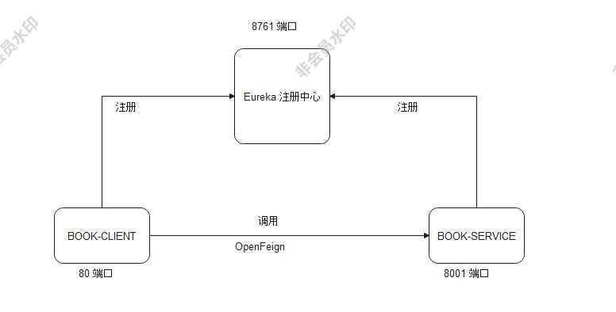
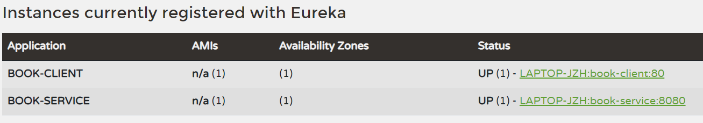
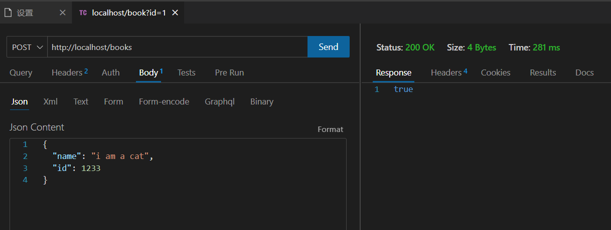
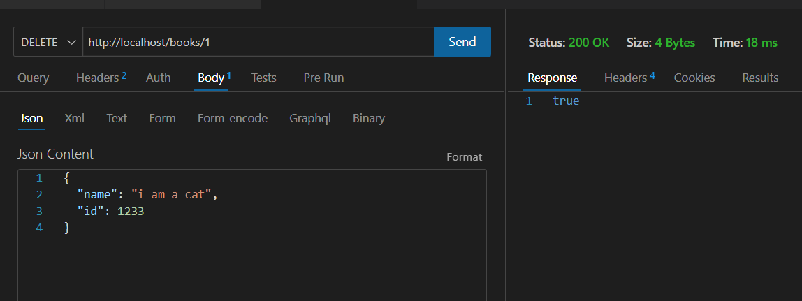
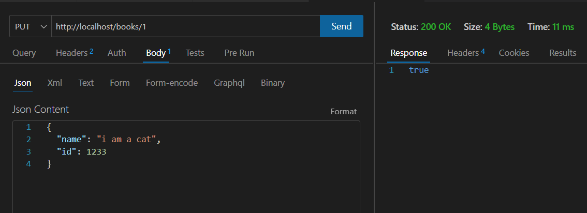
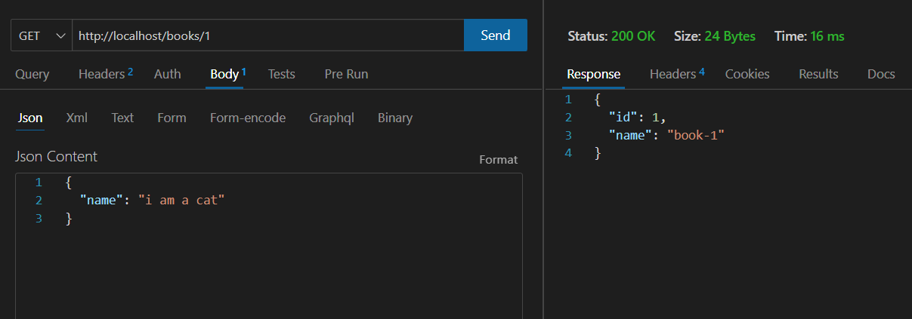
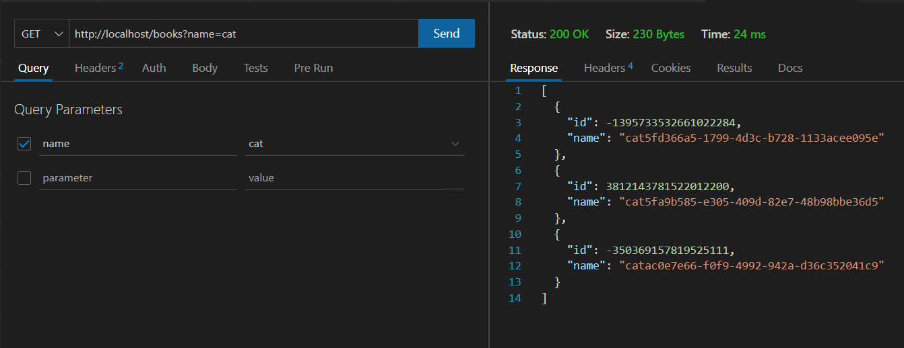

## 分布式计算第二次作业

### 作业要求

利用RPC技术实现一个基于C/S（客户端+服务器端）架构的书籍信息管理系统，具体要求：

客户端实现用户交互，服务器端实现书籍信息存储和管理。客户端与服务器端利用RPC机制进行协作。中间件任选。

服务器端至少暴露如下RPC接口：

bool add(Book b)   添加一个书籍对象。

Book queryByID(int bookID) 查询指定ID号的书籍对象。

BookList queryByName(String name) 按书名查询符合条件的书籍对象列表，支持模糊查询。

bool delete((int bookID) 删除指定ID号的书籍对象。

### 设计思路

我使用了 SpringCloud 作为工具进行系统的构建。

首先，使用 Eureka 构建微服务注册中心 LIBRARY-SERVER。

然后创建服务 BOOK-SERVICE 并注册入 LIBRARY-SERVER 中。

接着，构建用户客户端 BOOK-CLIENT，通过 OpenFeign 实现远程调用 BOOK-SERVICE 服务，然后也将其注册入 LIBRARY-SERVER 中。

具体的架构图如下所示：

### 运行结果

