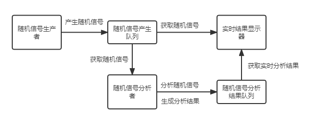

# 分布式计算第三次作业

- 姓名：江志航
- 学号：20009100359

## 作业要求

利用基于消息队列中间件的通信技术实现一个分布式随机信号分析系统，具体要求：

1. 随机信号产生器节点每隔100毫秒左右就产生一个正态分布的随机数字，并作为一个消息发布。

2. 随机信号统计分析节点对信号进行如下分析：

   （1）计算过去N个随机信号的均值和方差（N为常量，可设置）；

   （2）计算所有历史数据中的最大值和最小值；

   （3）定时地将分析结果打包成一个新消息并通过MOM发布出去。

3. 实时数据显示节点实现如下功能：

   （1）实时绘制过去一段时间内随机信号的折线图；

   （2）实时显示随机信号统计分析结果。

4. 消息中间件任选。

## 设计思路

我使用 rabbitmq 作为消息中间件完成这个作业。

设计架构如下图：

由随机信号生产者产生随机信号作为消息加入随机信号产生队列，实时结果显示器作为消费者从中获取实时信号作为输出，随机信号分析者也作为消费者从中获取实时信号进行分析，作为生产者产生实时分析结果，加入随机信号分析结果队列中，实时结果显示器作为消费者从中获取实时分析结果并作为输出。

对于 rabbitmq，请看以下架构图：

生产者和消费者与 rabbit 对接，首先需要建立一个与 rabbitmq 的连接，通过这个连接创建管道，由管道可以创建队列或者取得队列连接，与队列的连接需要首先通过一个交换机，每个队列与一个或多个路由键进行绑定，交换机通过指定的路由键进行路由。

在本实验中，我使用了默认的交换机，而路由键是队列的名称。

## 结果展示

